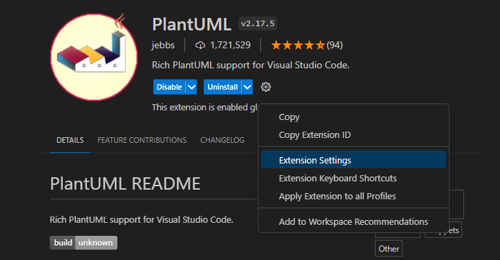
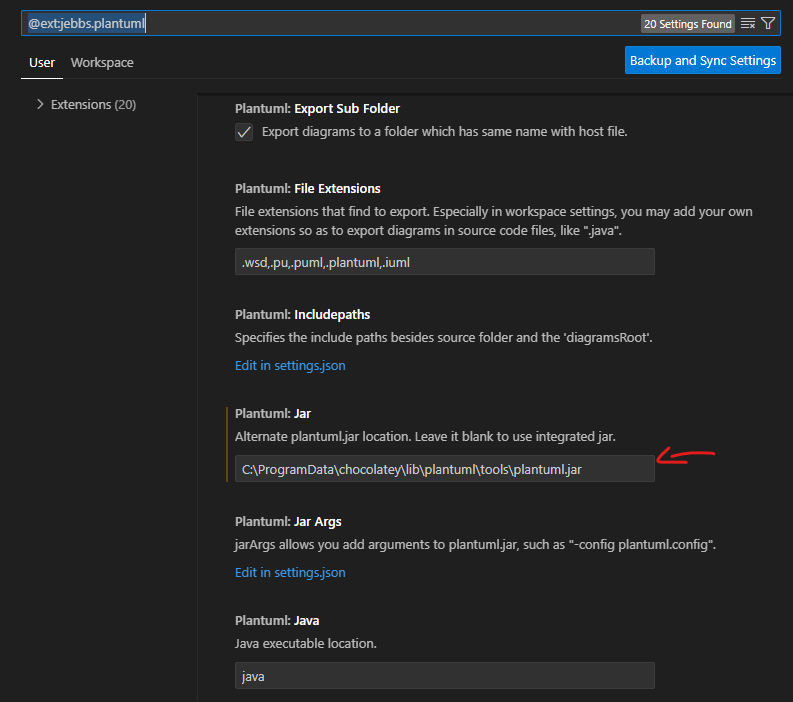
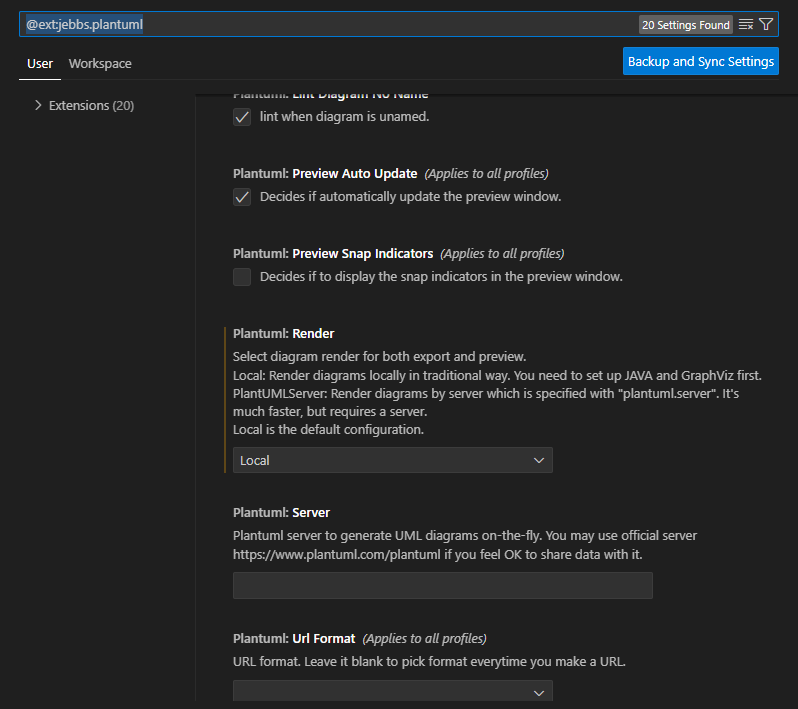

# ecommerce-plantuml
## This is the repository contain multiple diagram for ecommerce 
Draw using plantuml

## How to install plantuml for VSCode

Step 1: Install PlantUML extension
https://marketplace.visualstudio.com/items?itemName=jebbs.plantuml

Step 2: Install PlantUML and dependency using choco (cmd.exe with Administrator access):

```
"%SystemRoot%\System32\WindowsPowerShell\v1.0\powershell.exe" -NoProfile -ExecutionPolicy Bypass -Command "iex ((New-Object System.Net.WebClient).DownloadString('https://chocolatey.org/install.ps1'))" && SET "PATH=%PATH%;%ALLUSERSPROFILE%\chocolatey\bin"

choco install plantuml
```
if you have install choco before, just run the second line.
If it asking for install, input A (Yes for All)

Step 3: Add PlantUML jar path in extension setting and set render to local


if you cant find the folder, find the option to show hidden folder, it normally is: C:\ProgramData\chocolatey\lib\plantuml\tools\plantuml.jar


Set render to local


Step 4: Restart VSCode and you are good to go

